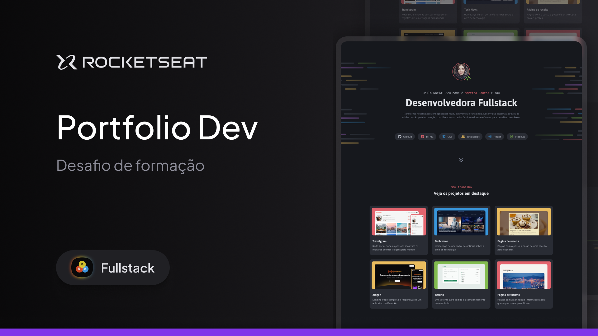

# Projeto de um Portifólio Dev

> Full-Stack - Projeto de um Portifólio Dev

este projeto nada mais é do que a crianção de um portifólio fictício de uma desenvolvedora fullstack.

## 👨‍💻 Tecnologia

- HTML
- CSS
- Git e Github

# 💭 O que aprendi?

neste projeto estudamos e usanamos CSS flexbox, posicionamento dos elementos, CSS grid, variáveis CSS e pseudo-class e pseudo-elements.

## 📚 Contato

- e-mail: lucas.primati@hotmail.com
- github: [🔗 github](https://github.com/luprime)
- Linkdedl: [🔗 Linkedln](https://www.linkedin.com/in/lucas-primati/)